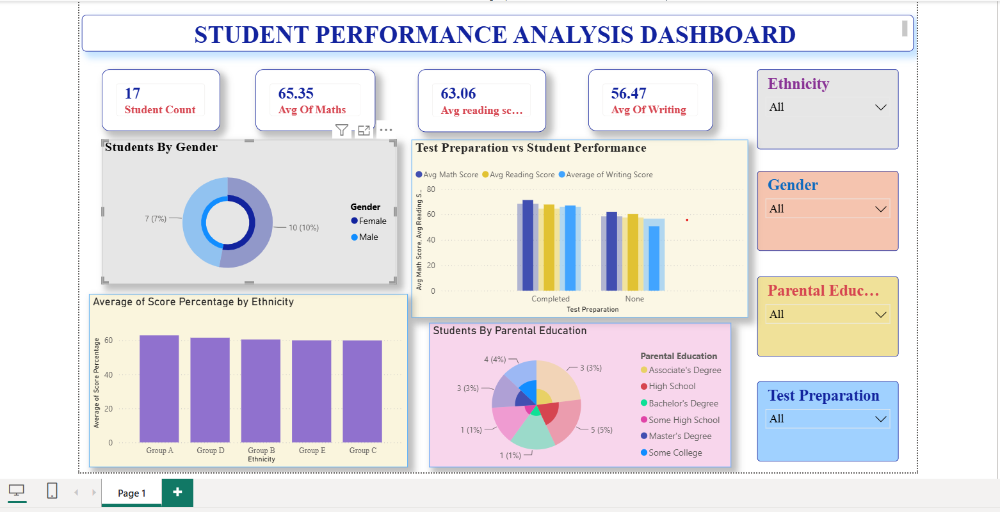

# Student Performance Analysis Dashboard

##  Overview

This project is a **Student Performance Analysis Dashboard** created using **Microsoft Power BI**.

The dashboard helps analyze student performance and explore how different factors such as gender, ethnicity, parental education, and test preparation relate to student scores.

##  Tools Used

- Microsoft Power BI
- Microsoft Excel

## Dataset

The dataset contains performance information for 100 students.

### Dataset Columns

- Student ID
- Gender
- Ethnicity
- Parental Education
- Test Preparation
- Math Score
- Reading Score
- Writing Score

## 🎯 Dashboard Questions

The dashboard was created to answer the following questions:

1. What is the overall average score of students in Math, Reading, and Writing?

2. What is the distribution of students by gender?

3. How does test preparation affect students' average Math, Reading, and Writing scores?

4. Which parental education level has the highest number of students?

5. How does student performance vary across different ethnicity groups?

6. How does student performance change when filtered by gender, ethnicity, parental education, or test preparation?

## Dashboard Features

- KPI cards for average Math, Reading, and Writing scores
- Total student count
- Gender distribution
- Test preparation vs student performance
- Students by parental education
- Performance comparison by ethnicity
- Interactive slicers for:
  - Gender
  - Ethnicity
  - Parental Education
  - Test Preparation

##  Dashboard Preview

## Key Learning

Through this project, I practiced:

- Data visualization using Power BI
- Creating KPI cards
- Creating charts and graphs
- Using slicers and filters
- Analyzing student performance
- Creating an interactive dashboard
- Presenting data insights in a visual format

## Dashboard

